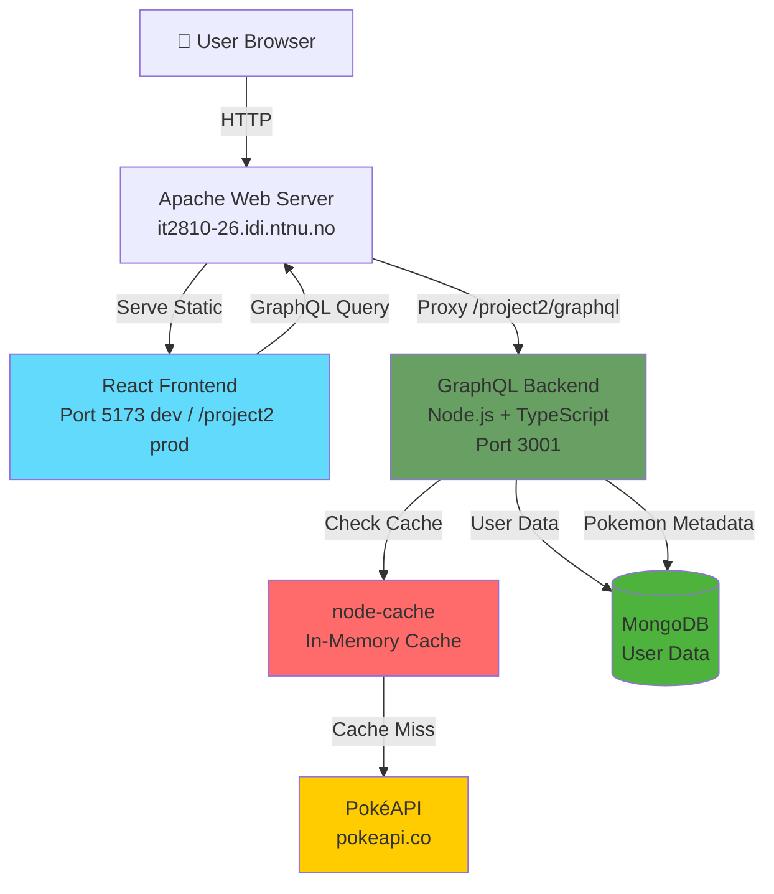

# PokéClicker - Prosjekt 2

IT2810 Webutvikling - Gruppe 26

[Live Demo](http://it2810-26.idi.ntnu.no/project2/) (Krever eduroam VPN utenfor NTNU)

## Prosjektkonsept

PokéClicker er en webapplikasjon som kombinerer et inkrementelt klikkespill med en søkbar Pokémon-database. Målet er å skape en interaktiv og engasjerende brukeropplevelse der spillmekanikk og datavisning fungerer sammen.

### Hvordan spillet fungerer

Brukere tjener "rare candy" ved å klikke på Pokémon i et GameBoy-inspirert grensesnitt. Rare candy kan brukes til å:

- Kjøpe nye Pokémon til sin personlige samling
- Oppgradere stats (HP, Attack, Defense, Sp. Attack, Sp. Defense, Speed)
- Øke inntekt per klikk og passiv inntekt

Spillmekanikken gir en naturlig motivasjon for brukere til å utforske Pokédex og interagere med systemet over tid.

## Oppfyllelse av kurskrav

### Funksjonalitet

| Krav                         | Implementasjon                                                                  |
| ---------------------------- | ------------------------------------------------------------------------------- |
| **Søkemulighet**             | Søkefelt med debouncing (300ms) for case-insensitive søk på Pokémon-navn        |
| **Listebasert presentasjon** | Grid-visning med "Load More" paginering (20 Pokémon per side)                   |
| **Detaljvisning**            | Modal med utvidet informasjon om stats, evolusjoner, habitat, abilities         |
| **Sortering og filtrering**  | Filtrering på region (Kanto/Johto/Hoenn) og type, sortering på ID/navn/type     |
| **Brukergenererte data**     | Brukerkontoer med personlige Pokémon-samlinger og upgrade-progresjon (planlagt) |
| **Universell utforming**     | ARIA-labels, tastaturnavigasjon, semantisk HTML, høy kontrast                   |
| **Bærekraftig webutvikling** | Debounced søk, lazy loading, optimalisert rendering, effektiv dataoverføring    |

### Teknologi

- **Frontend**: React 19 + TypeScript + Vite
- **State management**: React hooks (planlagt: Redux/Apollo for brukersesjon)
- **Styling**: Tailwind CSS + Radix UI komponenter
- **Backend**: GraphQL API (Node.js + TypeScript) _(planlagt for del 2)_
- **Database**: MongoDB på VM
- **Testing**: Vitest for komponenter, Playwright for E2E _(planlagt for del 3)_

## Status: Første underveisinnlevering

Denne innleveringen viser konseptet med mock data og statisk kodet eksempeldata. Vi demonstrerer:

**Implementert nå:**

- Pokédex med søk, filtrering og sortering (mock data i `src/data/mockData.ts`)
- Klikkespill med upgrade-system (localStorage for lokal lagring)
- Responsiv design med GameBoy-estetikk
- Paginering og debounced søk
- Modal med detaljert Pokémon-informasjon

**Planlagt for neste innlevering:**

- GraphQL backend på VM (port 3001)
- Database for brukere og brukerdata
- Autentisering/innlogging
- Pokémon API-integrasjon (PokéAPI) for dynamiske data

## Datamodell (planlagt)

### User (MongoDB document)

```typescript
interface User {
  _id: ObjectId;
  username: string;
  password_hash: string;
  created_at: Date;

  rare_candy: number;
  stats: {
    hp: number;
    attack: number;
    defense: number;
    sp_attack: number;
    sp_defense: number;
    speed: number;
  };
  owned_pokemon_ids: number[]; // Array av PokéAPI IDs
}
```

**Hvorfor MongoDB framfor PostgreSQL?**

Vi valgte MongoDB fordi vår datamodell ikke krever relasjonelle joins. All brukerdata lagres i ett enkelt dokument per bruker, med nested objects (stats) og arrays (owned_pokemon_ids). Dette gjør MongoDB til et bedre valg:

- **Ingen joins nødvendig**: Vi trenger aldri å slå sammen data fra flere tabeller
- **Naturlig datastruktur**: Stats lagres som nested object, ikke som separate rader
- **Array-operasjoner**: Legge til/sjekke Pokémon-eierskap er enklere med arrays
- **Fleksibilitet**: Lettere å legge til nye felt senere uten migrasjoner

### Pokémon-data (fra API)

Pokémon-informasjon (navn, typer, stats, sprites) hentes fra [PokéAPI](https://pokeapi.co/) i stedet for å lagres i egen database. Dette reduserer duplisering og holder data oppdatert.

### Caching-strategi

For å redusere antall API-kall til PokéAPI og forbedre responstid, bruker vi `node-cache` med to separate caches:

**API-cache (24 timer TTL):**

- Individuelle Pokémon cachet per ID
- Type-lister (alle Pokémon-URLer per type)
- Lang TTL fordi PokéAPI-data er statisk

**User-cache (5 minutters TTL):**

- Brukerens eide Pokémon
- Kortere TTL fordi data oppdateres oftere
- Invalideres automatisk ved endringer (f.eks. Pokémon-kjøp)

**Ytelsesgevinst:**

- Første request: ~190ms (API-kall til PokéAPI)
- Cachet request: ~3ms (fra minne)
- **60x raskere** for individuelle Pokémon
- Type-filtrering: ~270ms → ~90ms (3x raskere)

Cachen fungerer også som fallback hvis PokéAPI skulle være nede, så lenge dataen har blitt hentet minst én gang tidligere.

### Arkitektonisk beslutning: Pokédex-spørring med MongoDB

**Problemet vi møtte:**

Når vi skulle implementere Pokédex med søk, filtrering og sortering, møtte vi på en fundamental skaleringsproblematikk:

1. **PokéAPI REST begrensninger:**
   - Ingen server-side filtrering eller sortering
   - Kun individuelle oppslag (ett Pokémon per API-kall)
   - For å sortere 151 Kanto-Pokémon alfabetisk: Hent alle 151 (151 API-kall) → sorter i minne → vis 20
   - **Resultat**: 151+ API-kall for å vise 20 Pokémon

2. **PokéAPI GraphQL:**
   - Støtter filtrering/sortering på server-side
   - **Men**: 100 calls/time rate limit (gratis tier)
   - **Problem**: Med flere brukere og utviklere ville vi raskt treffe limit

3. **Naive løsning (vår første implementasjon):**

   ```javascript
   // Hent ALLE Pokémon → filtrer → sorter → returner 20
   const allPokemon = await fetchPokemon({limit: 1025});
   const filtered = allPokemon.filter(...);
   const sorted = filtered.sort(...);
   return sorted.slice(0, 20);
   ```

   - **Fungerer med 1025 Pokémon**, men...
   - **Skalerer IKKE**: Med 1 million Pokémon → Out of Memory
   - **Ineffektivt**: Henter 1005 Pokémon vi aldri viser
   - **Tregt**: Første load krever 1025 × 3 = ~3075 API-kall

**Vår løsning: MongoDB Metadata + PokéAPI Details**

```
Bruker → MongoDB (filtrer/sorter/paginer) → 20 Pokemon-IDer
      → PokéAPI (hent full data) → 20 Pokémon til bruker
```

**Implementasjon:**

1. **Seed Pokemon metadata til MongoDB** (`npm run seed` i backend/):
   - Basis-info: id, name, types, generation, sprite URL
   - Kjøres én gang for å populere databasen
   - ~1KB per Pokémon (minimalt lagringsbehov)

2. **MongoDB håndterer spørring:**

   ```javascript
   const pokemonMeta = await collection
     .find({generation: 'kanto', types: 'fire'})
     .sort({name: 1})
     .skip(0)
     .limit(20)
     .toArray();
   ```

   - Indeksert for rask søk
   - Støtter regex-søk, multi-felt filtrering
   - **Fungerer like raskt med 1 milliard poster** (med riktige indekser)

3. **Hent full data kun for de 20:**

   ```javascript
   const fullPokemon = await Promise.all(
     pokemonMeta.map((meta) => fetchPokemonById(meta.id))
   );
   ```

   - 20 API-kall i stedet for 1025+
   - Med caching: ~3ms per Pokémon etter første gang

**Hvorfor dette er skalerbart:**

- ✅ **O(log n) queries**: MongoDB bruker B-tree indekser
- ✅ **Konstant API-bruk**: Alltid kun 20 API-kall per side (limit-parameter)
- ✅ **Lav minnebruk**: Kun 20 Pokémon i minne, ikke alle 1025
- ✅ **Rask respons**: Database-query < 10ms, API-kall paralleliseres
- ✅ **Fungerer med milliarder**: Arkitekturen endrer seg ikke med datavolum

## Kjøre prosjektet lokalt

### 1. Installere Node.js og MongoDB

**Node.js:**

- Last ned og installer fra [nodejs.org](https://nodejs.org/) (LTS versjon anbefales)
- Sjekk at det virker: åpne terminal og skriv `node --version`

**MongoDB:**

<details>
<summary><b>Windows</b></summary>

1. Last ned MongoDB Community Server fra [mongodb.com/try/download/community](https://www.mongodb.com/try/download/community)
2. Kjør installeren (.msi filen)
3. Velg "Complete" installation
4. **Viktig:** Huk av "Install MongoDB as a Service" (slik at den starter automatisk)
5. Sjekk at MongoDB kjører:
   - Åpne "Services" (søk etter det i start-menyen)
   - Finn "MongoDB Server" - den skal vise "Running"
6. Hvis den ikke kjører, høyreklikk og velg "Start"

</details>

<details>
<summary><b>macOS</b></summary>

```bash
# Installer Homebrew hvis du ikke har det:
/bin/bash -c "$(curl -fsSL https://raw.githubusercontent.com/Homebrew/install/HEAD/install.sh)"

# Installer MongoDB:
brew tap mongodb/brew
brew install mongodb-community

# Start MongoDB:
brew services start mongodb-community

# Sjekk at den kjører:
brew services list | grep mongodb
```

</details>

<details>
<summary><b>Linux (Ubuntu/Debian)</b></summary>

```bash
# Importer MongoDB public GPG Key:
curl -fsSL https://www.mongodb.org/static/pgp/server-7.0.asc | sudo gpg --dearmor -o /usr/share/keyrings/mongodb-server-7.0.gpg

# Legg til MongoDB repository:
echo "deb [ signed-by=/usr/share/keyrings/mongodb-server-7.0.gpg ] https://repo.mongodb.org/apt/ubuntu jammy/mongodb-org/7.0 multiverse" | sudo tee /etc/apt/sources.list.d/mongodb-org-7.0.list

# Installer MongoDB:
sudo apt-get update
sudo apt-get install -y mongodb-org

# Start MongoDB:
sudo systemctl start mongod
sudo systemctl enable mongod  # Start automatisk ved oppstart

# Sjekk at den kjører:
sudo systemctl status mongod
```

</details>

### 2. Klone og installere prosjektet

```bash
# Klon prosjektet
git clone https://git.ntnu.no/IT2810-H25/T26-Project-2.git
cd T26-Project-2

# Installer frontend dependencies
npm install

# Installer backend dependencies
cd backend
npm install
cd ..
```

### 3. Populer databasen med Pokemon (PÅKREVD!)

Dette steget er **påkrevd** første gang du setter opp prosjektet:

```bash
cd backend
npm run seed
```

Dette henter metadata for ~1024 Pokemon fra PokéAPI og lagrer i MongoDB. Tar ca. **1-2 minutter**. Du ser fremdrift i terminalen.

**Du trenger kun å gjøre dette én gang.** Neste gang du starter prosjektet kan du hoppe over dette steget.

### 4. Sett opp miljøvariabler (valgfritt)

Hvis du vil bruke en annen database-URL, opprett `backend/.env`:

```env
MONGODB_URI=mongodb://localhost:27017
MONGODB_DB_NAME=pokeclicker_db
PORT=3001
```

Standard-verdiene over fungerer uten `.env`-fil.

### Utviklingsmiljø

```bash
# Fra root-directory:
npm run dev:all   # Start både frontend og backend

# Eller kjør separat:
npm run dev       # Kun frontend (port 5173)
cd backend && npm run dev  # Kun backend (port 3001)

# Andre kommandoer:
npm run build     # Bygg for produksjon
npm run lint      # Kjør linting
```

## Arkitektur



**Data Flow**:

1. Frontend queries GraphQL endpoint
2. Backend checks cache (Pokemon: 24h, User: 5min TTL)
3. Cache miss → fetch from PokéAPI
4. MongoDB stores user data + Pokemon metadata for search/filter
5. Results returned to frontend

## GraphQL API

Full API documentation: [GRAPHQL.md](./docs/GRAPHQL.md)

**Endpoint**: `http://it2810-26.idi.ntnu.no/project2/graphql`

**Key Queries**:

- `pokedex()` - Search, filter, sort Pokemon with ownership tracking
- `pokemonById(id)` - Detailed Pokemon info
- `me` - Current user data

**Key Mutations**:

- `signup/login` - User authentication (JWT)
- `purchasePokemon(id)` - Buy Pokemon with rare candy
- `upgradeStat(stat)` - Upgrade user stats

## Environment Variables

### Backend (`.env` in `backend/`)

```env
# Server Configuration
PORT=3001

# MongoDB Configuration
MONGODB_URI=mongodb://localhost:27017
MONGODB_DB_NAME=pokeclicker_db
```

**Notes**:

- Default values work out-of-the-box for local development
- Production deployment uses same MongoDB on VM
- No secrets required (authentication planned for future)

### Frontend

No environment variables needed. API endpoint auto-detected:

- Development: `http://localhost:3001/`
- Production: `/project2/graphql` (proxied by Apache)

## Fremtidig utvikling

### Del 3 - Fullstendig prototype

- Leaderboard/statistikk
- Tilgjengelighetstesting
- Achievements system

### Del 4 - Testing og kvalitetssikring

- Vitest for komponenter og utilities
- Playwright E2E-tester
- Performance-optimalisering
- Kodekvalitet og dokumentasjon
