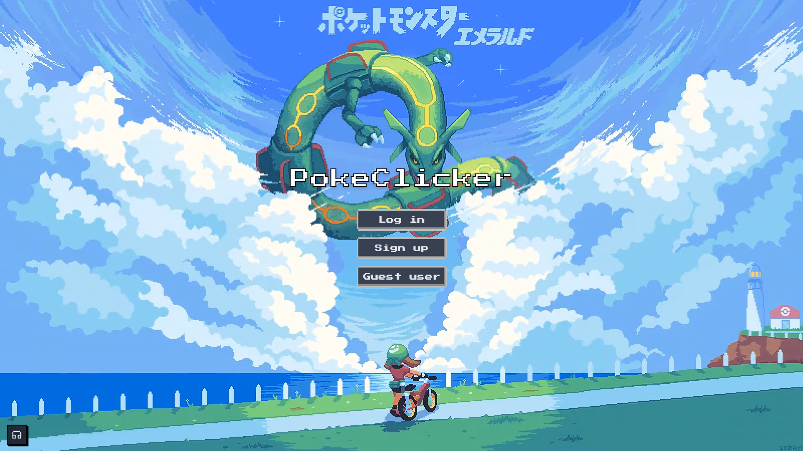
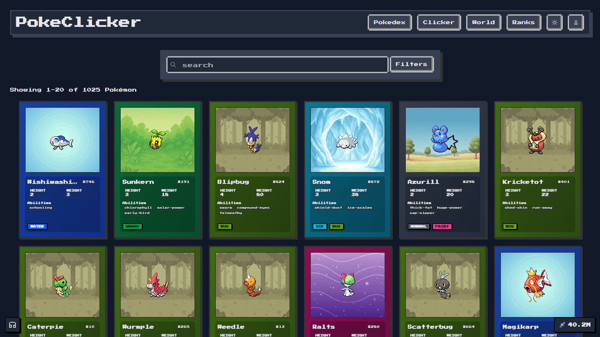
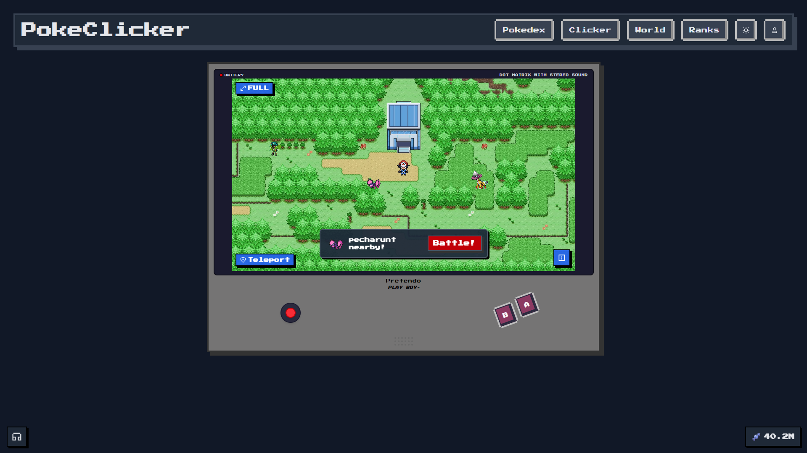
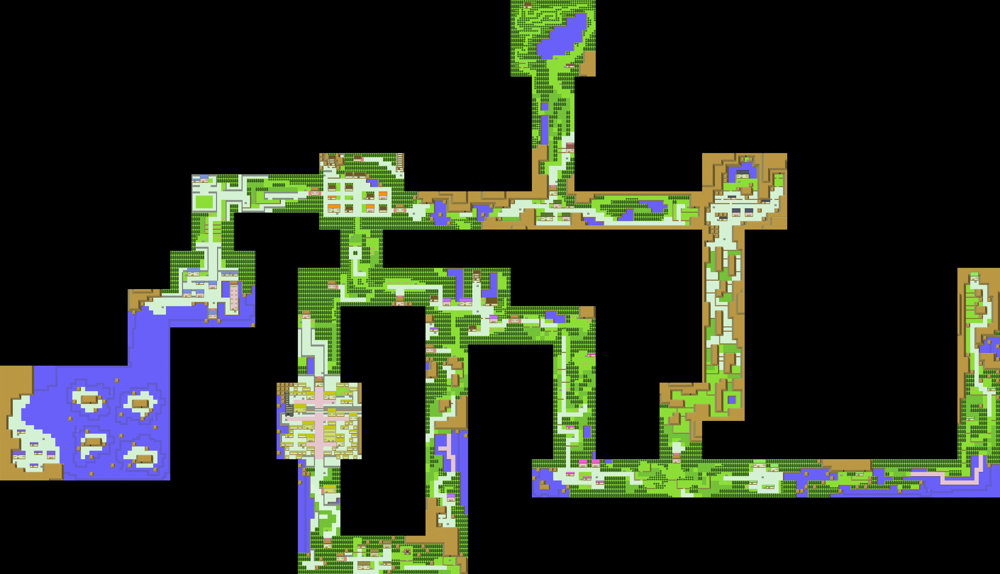

# PokéClicker - Project 2

IT2810 Web Development - Group 26

[Live Demo](http://it2810-26.idi.ntnu.no/project2/) (Requires eduroam VPN outside NTNU)

([Backup](https://pokeclicker.no/) if the server is down)

## Documentation

**[Setup Guide](./docs/setup.md)** | **[Architecture](./docs/architecture.md)** | **[Testing](./docs/testing.md)** | **[Security](./docs/security.md)** | **[Sustainability](./docs/sustainability.md)** | **[Development Workflow](./docs/development-workflow.md)** | **[AI Usage](./docs/ai-usage.md)**

## Project Concept

PokéClicker is a web application that combines an incremental clicker game with a searchable Pokémon database. The goal is to create an interactive and engaging user experience where game mechanics and data visualization work together.

### How the Game Works

Users earn "rare candy" by clicking on Pokémon in a GameBoy-inspired interface. Rare candy can be used to:

- Purchase new Pokémon for their personal collection
- Upgrade stats (HP, Attack, Defense, Sp. Attack, Sp. Defense, Speed)
- Increase income per click and passive income

The game mechanics provide a natural motivation for users to explore the Pokédex and interact with the system over time.

## Images of the Most Important Pages

<div style="display: flex; flex-wrap: wrap; gap: 20px;">
  <div style="flex: 1; min-width: 600px;">
    <h3>Login Page</h3>
    
    <h4>Log in, sign up or use a guest user</h4>
  </div>

  <div style="flex: 1; min-width: 600px;">
    <h3>Pokedex Page</h3>
    
    <h4>View, filter, search, purchase, and upgrade Pokémon. Watch your personal collection grow!</h4>
  </div>

  <div style="flex: 1; min-width: 600px;">
    <h3>Pokeclicker Page</h3>
    
    <h4>Click to earn Rare Candy and use upgrades to boost earnings and efficiency.</h4>
  </div>

  <div style="flex: 1; min-width: 600px;">
    <h3>World Page</h3>
    
    <h4>Explore the map and battle wild Pokémon. Win to gain Rare Candy and new Pokémon.</h4>
  </div>
</div>

## Before and After Photos of the Map

<div>
  <h3>The original map</h3>
  
  <h4>The original map from Pokémon Gold and Silver (1999). Showing the Johto region</h4>
</div>

<div>
  <h3>The map we started with</h3>
  
  <h4>We found a modern version. The initial map contained many missing or corrupted tiles, visual artifacts, and inconsistent layering, making navigation and gameplay testing difficult. This version served as the baseline for our cleanup, collision mapping, and redesign.</h4>
</div>

<div>
  <h3>Our redesign of the map</h3>
  
  <h4>We rebuilt the map by filling missing tiles, removing visual artifacts, and re-layering elements for consistent visuals and proper overlap. The result improves navigation and gameplay, making the map feel
  complete and seamless.</h4>
</div>

<div>
  <h3>Walkable places</h3>
  
  <h4>We mapped the areas where the player can walk and where Pokémon can spawn. We also added a transparency effect when the player moves through caves, houses, and trees.</h4>
</div>

## Quick Start

```bash
# Clone repository
git clone https://git.ntnu.no/IT2810-H25/T26-Project-2.git
cd T26-Project-2

# Install dependencies (use npm or pnpm)
npm install

# Seed database (required first time)
npm run seed --workspace=backend

# Start both frontend and backend
npm run dev
```

**Note**: This project supports both npm and pnpm interchangeably.

See [Setup Guide](./docs/setup.md) for MongoDB installation and environment configuration.

## Course Requirements

### Functionality

| Requirement                    | Implementation                                                                                                                    |
| ------------------------------ | ----------------------------------------------------------------------------------------------------------------------------------|
| **Search capability**          | Search field with debouncing (300ms) for case-insensitive Pokémon name search                                                     |
| **List-based presentation**    | Grid view with page pagination (20 Pokémon per page)                                                                              |
| **Detail view**                | Modal with extended information about stats, evolutions, type, abilities                                                          |
| **Sorting and filtering**      | Filtering by region (Kanto/Johto/Hoenn) and type, sorting by price/stats/id/name/type, filter order and what to filter on          |
| **User-generated data**        | User accounts with personal Pokémon collections and upgrade progression                                                           |
| **Universal design**           | ARIA-labels, keyboard navigation, semantic HTML, high contrast                                                                    |
| **Sustainable web development**| Debounced search, lazy loading, optimized rendering, efficient data transfer                                                      |

### Technology

- **Frontend**: React 19 + TypeScript + Vite
- **State management**: React hooks with Apollo Client
- **Styling**: Tailwind CSS + Radix UI components
- **Backend**: GraphQL API (Node.js + TypeScript)
- **Database**: MongoDB on VM
- **Testing**: Vitest + React Testing Library + Playwright (417 unit tests + E2E)

## Technical Highlights

### Virtual Rendering
- Only renders 3 Pokemon at a time in carousel (current ± 1)
- Evolution chains loaded on-demand when Pokemon becomes visible
- Eliminates unnecessary API calls for off-screen content
- Prevents rate limiting and reduces server load

### Smart Caching Strategy
- **API-cache (24h TTL)**: Pokémon data from PokéAPI - long TTL because data is static
- **User-cache (5min TTL)**: User data and owned Pokémon - short TTL because data changes frequently
- **IndexedDB**: Persistent image caching across sessions for sprites and backgrounds
- Appropriate TTLs balance freshness with performance

### Code Splitting and Lazy Loading
- **Route-based splitting**: Each page (Pokédex, Clicker, Map, Profile) loaded only when accessed
- **Component-level splitting**: Heavy components (SearchBar, Filters, PokemonCard) lazy-loaded with Suspense
- Reduces initial bundle size and improves time-to-interactive

### Handling Extremely Large Numbers
**The Problem**: In idle clicker games, numbers grow exponentially. JavaScript's native numbers only go up to about 9 quadrillion (9,007,199,254,740,991) before losing precision. Legendary Pokémon in our game cost 49 decillion rare candy - a number so large it would break the game.

**Our Solution**: We use a special number library (`break_infinity.js`) that handles numbers up to 10^100 (a googol). Every rare candy amount in the database is stored as text, processed with custom decimal arithmetic, and displayed with friendly suffixes like "4.9E34" or "49 Decillion". This allows unlimited exponential progression without mathematical errors.

### Instant UI Feedback
**The Problem**: When you buy a Pokémon, normally the app would show a loading spinner while waiting for the server to confirm. This feels slow and unresponsive.

**Our Solution**: The UI updates instantly when you click "Purchase" - your rare candy decreases and the Pokémon is marked as owned immediately. Behind the scenes, we send the request to the server. If it fails, we automatically undo the change. This makes the app feel instant even on slow connections.

### Efficient Map Collision Detection
**The Problem**: Our game map is 10,560 × 6,080 pixels. To determine where the player can walk, we need to check each pixel - that's 64 million pixels to analyze, requiring 168MB of memory on mobile devices.

**Our Solution**: We shrink the collision map to 1/4 size (2,640 × 1,520) and color-code it: magenta = walkable, cyan = partially walkable (see [walkable areas visualization](#before-and-after-photos-of-the-map)). This reduces memory usage to just 16MB. When checking if a position is walkable, we sample the color of nearby pixels and use fuzzy matching to handle image compression artifacts. The processing happens in the background so it doesn't freeze the UI.

### Security Hardening
- No hardcoded secrets
- JWT token authentication
- Rate limiting (1000 req/15min)
- Environment variable validation

Read more: [Architecture](./docs/architecture.md) | [Security](./docs/security.md) | [Sustainability](./docs/sustainability.md)

## GraphQL API

**Endpoint**: `http://it2810-26.idi.ntnu.no/project2/graphql`

**Key Queries**:
- `pokedex()` - Search, filter, sort Pokemon with ownership tracking
- `pokemonById(id)` - Detailed Pokemon info
- `me` - Current user data

**Key Mutations**:
- `signup/login` - User authentication (JWT)
- `purchasePokemon(id)` - Buy Pokemon with rare candy
- `upgradeStat(stat)` - Upgrade user stats

[Full API Reference](./docs/GRAPHQL.md)

## Testing

**417 unit tests** + E2E tests with Playwright:
- 365 frontend tests (hooks, components, integration)
- 52 backend tests (resolvers, auth, database)

> [!IMPORTANT]
> Make sure to complete the [Setup Guide](./docs/setup.md) before running tests to ensure the environment is correctly configured.

```bash
# Run all tests
npx playwright install  # Install browsers (required first time)
npm run test:e2e        # E2E tests
cd frontend && npm test # Frontend unit tests
cd backend && npm test  # Backend unit tests
```

[Testing Strategy & Coverage](./docs/testing.md)

## AI-Assisted Development

This project was developed with extensive use of AI assistance through Claude Code. AI handled most of the implementation, while humans made all architectural and design decisions and performed active code reviews.

[Full AI Usage Documentation](./docs/ai-usage.md)

## Deployment

**Production**: `http://it2810-26.idi.ntnu.no/project2/` (Requires NTNU VPN)

Runs on NTNU VM with Apache reverse proxy. [Deployment Guide](./docs/deployment.md)

## Contributors

Group 26 - IT2810 H25

## License

This project is part of an academic course at NTNU.
