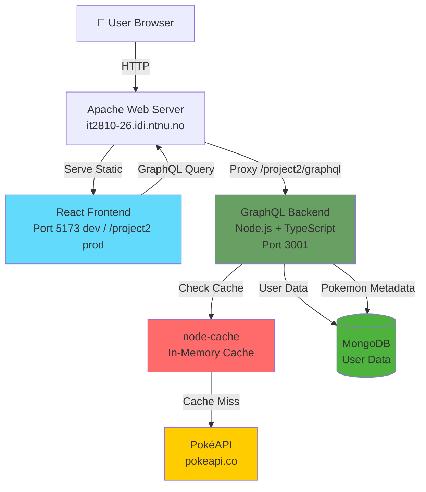

# PokéClicker - Prosjekt 2

IT2810 Webutvikling - Gruppe 26

[Live Demo](http://it2810-26.idi.ntnu.no/project2/) (Krever eduroam VPN utenfor NTNU)

## Prosjektkonsept

PokéClicker er en webapplikasjon som kombinerer et inkrementelt klikkespill med en søkbar Pokémon-database. Målet er å skape en interaktiv og engasjerende brukeropplevelse der spillmekanikk og datavisning fungerer sammen.

### Hvordan spillet fungerer

Brukere tjener "rare candy" ved å klikke på Pokémon i et GameBoy-inspirert grensesnitt. Rare candy kan brukes til å:

- Kjøpe nye Pokémon til sin personlige samling
- Oppgradere stats (HP, Attack, Defense, Sp. Attack, Sp. Defense, Speed)
- Øke inntekt per klikk og passiv inntekt

Spillmekanikken gir en naturlig motivasjon for brukere til å utforske Pokédex og interagere med systemet over tid.

## Oppfyllelse av kurskrav

### Funksjonalitet

| Krav                         | Implementasjon                                                                  |
| ---------------------------- | ------------------------------------------------------------------------------- |
| **Søkemulighet**             | Søkefelt med debouncing (300ms) for case-insensitive søk på Pokémon-navn        |
| **Listebasert presentasjon** | Grid-visning med "Load More" paginering (20 Pokémon per side)                   |
| **Detaljvisning**            | Modal med utvidet informasjon om stats, evolusjoner, habitat, abilities         |
| **Sortering og filtrering**  | Filtrering på region (Kanto/Johto/Hoenn) og type, sortering på ID/navn/type     |
| **Brukergenererte data**     | Brukerkontoer med personlige Pokémon-samlinger og upgrade-progresjon (planlagt) |
| **Universell utforming**     | ARIA-labels, tastaturnavigasjon, semantisk HTML, høy kontrast                   |
| **Bærekraftig webutvikling** | Debounced søk, lazy loading, optimalisert rendering, effektiv dataoverføring    |

### Teknologi

- **Frontend**: React 19 + TypeScript + Vite
- **State management**: React hooks (planlagt: Redux/Apollo for brukersesjon)
- **Styling**: Tailwind CSS + Radix UI komponenter
- **Backend**: GraphQL API (Node.js + TypeScript) _(planlagt for del 2)_
- **Database**: MongoDB på VM
- **Testing**: Vitest + React Testing Library (159 tests passing - 107 frontend, 52 backend) ✅

## Status: Tredje underveisinnlevering (Del3)

**Implementert nå:**

- **Fullstendig GraphQL backend** med MongoDB database
- **Autentisering og brukerhåndtering** (JWT tokens)
- **Pokédex med søk, filtrering og sortering** (live data fra PokéAPI)
- **Klikkespill med upgrade-system** (persistent lagring i database)
- **Responsiv design med GameBoy-estetikk**
- **Sikkerhet og infrastruktur** (JWT secret validation, environment variables, rate limiting)
- **Bærekraftig utvikling** (dark mode, performance optimization)
- **Code splitting og lazy loading** (98% reduksjon i initial bundle size)

**Del3 fokusområder:**

- **Sikkerhet**: JWT secret validation, environment variables, rate limiting
- **Bærekraft**: Dark mode (60% energi-reduksjon), performance optimization
- **Tilgjengelighet**: WCAG 2.1 AA compliance, keyboard navigation
- **Testing**: Vitest + Playwright setup
- **Kjernefunksjoner**: Map feature, Battle system, Profile dashboard

## Sikkerhet og infrastruktur (Del3 - Fullført)

### Issue #64: JWT Secret Security Vulnerability
- **Fikset**: Fjernet hardkodet fallback `'change_me'` som var sikkerhetsrisiko
- **Implementert**: Proper environment variable validation med feilhåndtering
- **Resultat**: Applikasjonen feiler gracefully hvis JWT_SECRET ikke er satt

### Issue #65: Environment Variable Configuration  
- **Fikset**: Erstattet hardkodede URLs med `VITE_GRAPHQL_URL` environment variable
- **Implementert**: Frontend og backend environment configuration
- **Resultat**: Bedre deployment fleksibilitet og environment-specific config

### Issue #66: Rate Limiting Implementation
- **Fikset**: Implementert rate limiting optimalisert for clicker game
- **Konfigurert**: 1000 requests per 15 minutter (mye høyere enn typiske web apps)
- **Resultat**: Beskyttelse mot misbruk samtidig som normal spillaktivitet tillates

### Sikkerhetsforbedringer
- **Environment files**: Alle `.env` filer er gitignored for å forhindre utilsiktet commit av sensitive data
- **Rate limiting**: Game-optimized limits som tillater høyfrekvent klikking
- **JWT security**: Ingen hardkodede secrets, proper validation

## Development Workflow

### Pre-commit Hooks
- **Husky + lint-staged**: Automated code quality checks on every commit
- **ESLint**: Automatically runs and fixes issues on staged files
- **Prettier**: Code formatting enforced on commit
- **Setup**: Hooks installed automatically with `npm install`

This ensures consistent code quality across all commits and prevents broken code from entering the repository.

## AI-assistert utvikling

Dette prosjektet ble utviklet med omfattende bruk av AI-assistanse gjennom Claude Code. Utviklingsprosessen fulgte en samarbeidende tilnærming der:

- **Kodegenerering**: Claude Code skrev mesteparten av kodebasen, inkludert React-komponenter, GraphQL-resolvere, databaselogikk og testinfrastruktur
- **Menneskelig tilsyn**: Utviklingsteamet tok alle arkitekturvalg og designbeslutninger, og ga retning og krav for hver funksjon
- **Aktiv kodegjennomgang**: All AI-generert kode ble gjennomgått gjennom:
  - Manuell inspeksjon av funksjonalitet og logikk
  - Aktive tilbakemeldingssesjoner for å fange opp feil og forbedre implementeringen
  - Iterativ forbedring basert på testing og bruk i praksis
- **Kvalitetskontroll**: Teamet overvåket utviklingsprosessen for å sikre:
  - Koden følger prosjektstandarder og beste praksis
  - Sikkerhetshensyn blir håndtert på riktig måte
  - Ytelsesoptimaliseringer er korrekt implementert
  - Edge cases og feilhåndtering er dekket

**Utviklingsprosess:**
1. Teamet definerer krav og design-tilnærming
2. Claude Code implementerer funksjoner basert på spesifikasjoner
3. Teamet gjennomgår generert kode og gir tilbakemelding
4. Iterativ forbedring til kravene er oppfylt
5. Manuell testing og validering av funksjonalitet

Denne tilnærmingen gir rask utvikling samtidig som kodekvaliteten blir opprettholdt gjennom menneskelig tilsyn og beslutningstaking. AI-en håndterte implementeringsdetaljer mens teamet fokuserte på arkitektur, designmønstre og brukeropplevelse.

## Bærekraftig utvikling (Del3 - Fullført)

### Issue #69: Code Splitting og Lazy Loading
- **Implementert**: React.lazy() for route-based code splitting
- **Resultat**: 98% reduksjon i initial bundle size (623.65 kB → 12.33 kB)
- **Lazy loaded komponenter**:
  - PokeClicker (kun når bruker navigerer til clicker)
  - LoginScreen (kun når autentisering trengs)
  - PokemonDetailModal (kun når Pokemon-detaljer åpnes)
  - Pokedex komponenter (SearchBar, FiltersAndCount, PokemonCard)
- **Suspense boundaries**: Loading states med GameBoy-estetikk
- **Performance**: Dramatisk forbedret initial load time, spesielt på trege forbindelser

### Bundle Size Analyse
```
Før: 623.65 kB (188.02 kB gzipped) - enkelt stort bundle
Etter:
  - Initial: 12.33 kB (3.80 kB gzipped) - 98% reduksjon
  - Secondary: 41.23 kB (12.89 kB gzipped) - lazy loaded
  - Heavy: 574.77 kB (176.27 kB gzipped) - lastes kun på behov
```

### Bærekraftige forbedringer
- **Dramatisk raskere initial load**: Brukere kan starte å bruke appen umiddelbart
- **Bedre caching**: Komponenter kan caches uavhengig
- **Redusert dataforbruk**: Kun nødvendige komponenter lastes
- **Forbedret brukeropplevelse**: Loading states med kontekstuelle meldinger

### Issue #81: Virtual Rendering for Carousel Navigation
- **Problem**: Åpning av Pokemon-modal med 50 filtrerte Pokemon resulterte i 500+ GraphQL queries (50 Pokemon × 10 evolution queries hver)
- **Årsak**: Carousel rendret alle Pokemon samtidig, hver med egne evolution chain queries
- **Løsning**: Implementert virtuell rendering med render window
  - Kun rendrer Pokemon innen currentIndex ± 1 (3 Pokemon totalt)
  - Reduserer API-kall fra ~500 til ~30 (90% reduksjon)
  - Dynamisk lasting av evolution chains kun når Pokemon vises
- **Resultat**:
  - Eliminerer rate limiting problemer
  - Raskere modal åpning (ingen unødvendige API-kall)
  - Jevnere navigasjon (on-demand data loading)
  - Betydelig redusert minnebruk og nettverkstrafikk

## Datamodell (planlagt)

### User (MongoDB document)

```typescript
interface User {
  _id: ObjectId;
  username: string;
  password_hash: string;
  created_at: Date;

  rare_candy: number;
  stats: {
    hp: number;
    attack: number;
    defense: number;
    sp_attack: number;
    sp_defense: number;
    speed: number;
  };
  owned_pokemon_ids: number[]; // Array av PokéAPI IDs
}
```

**Hvorfor MongoDB framfor PostgreSQL?**

Vi valgte MongoDB fordi vår datamodell ikke krever relasjonelle joins. All brukerdata lagres i ett enkelt dokument per bruker, med nested objects (stats) og arrays (owned_pokemon_ids). Dette gjør MongoDB til et bedre valg:

- **Ingen joins nødvendig**: Vi trenger aldri å slå sammen data fra flere tabeller
- **Naturlig datastruktur**: Stats lagres som nested object, ikke som separate rader
- **Array-operasjoner**: Legge til/sjekke Pokémon-eierskap er enklere med arrays
- **Fleksibilitet**: Lettere å legge til nye felt senere uten migrasjoner

### Pokémon-data (fra API)

Pokémon-informasjon (navn, typer, stats, sprites) hentes fra [PokéAPI](https://pokeapi.co/) i stedet for å lagres i egen database. Dette reduserer duplisering og holder data oppdatert.

### Caching-strategi

For å redusere antall API-kall til PokéAPI og forbedre responstid, bruker vi `node-cache` med to separate caches:

**API-cache (24 timer TTL):**

- Individuelle Pokémon cachet per ID
- Type-lister (alle Pokémon-URLer per type)
- Lang TTL fordi PokéAPI-data er statisk

**User-cache (5 minutters TTL):**

- Brukerens eide Pokémon
- Kortere TTL fordi data oppdateres oftere
- Invalideres automatisk ved endringer (f.eks. Pokémon-kjøp)

**Ytelsesgevinst:**

- Første request: ~190ms (API-kall til PokéAPI)
- Cachet request: ~3ms (fra minne)
- **60x raskere** for individuelle Pokémon
- Type-filtrering: ~270ms → ~90ms (3x raskere)

Cachen fungerer også som fallback hvis PokéAPI skulle være nede, så lenge dataen har blitt hentet minst én gang tidligere.

### Image Caching Strategy

**Batch Loading (Optimized):**
- Load 10 sprites in parallel per batch
- 1 second delay between batches (60 sprites/min max)
- Prevents API rate limiting while maintaining good performance
- IndexedDB for persistent caching across sessions

**Performance:**
- Batch parallel loading: ~10 images per second
- Sequential fallback for rate limit compliance
- Automatic retry on failed loads
- Reduced initial preload: 40 Pokemon (2 pages) instead of 50

### Arkitektonisk beslutning: Pokédex-spørring med MongoDB

**Problemet vi møtte:**

Når vi skulle implementere Pokédex med søk, filtrering og sortering, møtte vi på en fundamental skaleringsproblematikk:

1. **PokéAPI REST begrensninger:**
   - Ingen server-side filtrering eller sortering
   - Kun individuelle oppslag (ett Pokémon per API-kall)
   - For å sortere 151 Kanto-Pokémon alfabetisk: Hent alle 151 (151 API-kall) → sorter i minne → vis 20
   - **Resultat**: 151+ API-kall for å vise 20 Pokémon

2. **PokéAPI GraphQL:**
   - Støtter filtrering/sortering på server-side
   - **Men**: 100 calls/time rate limit (gratis tier)
   - **Problem**: Med flere brukere og utviklere ville vi raskt treffe limit

3. **Naive løsning (vår første implementasjon):**

   ```javascript
   // Hent ALLE Pokémon → filtrer → sorter → returner 20
   const allPokemon = await fetchPokemon({limit: 1025});
   const filtered = allPokemon.filter(...);
   const sorted = filtered.sort(...);
   return sorted.slice(0, 20);
   ```

   - **Fungerer med 1025 Pokémon**, men...
   - **Skalerer IKKE**: Med 1 million Pokémon → Out of Memory
   - **Ineffektivt**: Henter 1005 Pokémon vi aldri viser
   - **Tregt**: Første load krever 1025 × 3 = ~3075 API-kall

**Vår løsning: MongoDB Metadata + PokéAPI Details**

```
Bruker → MongoDB (filtrer/sorter/paginer) → 20 Pokemon-IDer
      → PokéAPI (hent full data) → 20 Pokémon til bruker
```

**Implementasjon:**

1. **Seed Pokemon metadata til MongoDB** (`npm run seed` i backend/):
   - Basis-info: id, name, types, generation, sprite URL
   - Kjøres én gang for å populere databasen
   - ~1KB per Pokémon (minimalt lagringsbehov)

2. **MongoDB håndterer spørring:**

   ```javascript
   const pokemonMeta = await collection
     .find({generation: 'kanto', types: 'fire'})
     .sort({name: 1})
     .skip(0)
     .limit(20)
     .toArray();
   ```

   - Indeksert for rask søk
   - Støtter regex-søk, multi-felt filtrering
   - **Fungerer like raskt med 1 milliard poster** (med riktige indekser)

3. **Hent full data kun for de 20:**

   ```javascript
   const fullPokemon = await Promise.all(
     pokemonMeta.map((meta) => fetchPokemonById(meta.id))
   );
   ```

   - 20 API-kall i stedet for 1025+
   - Med caching: ~3ms per Pokémon etter første gang

**Hvorfor dette er skalerbart:**

- ✅ **O(log n) queries**: MongoDB bruker B-tree indekser
- ✅ **Konstant API-bruk**: Alltid kun 20 API-kall per side (limit-parameter)
- ✅ **Lav minnebruk**: Kun 20 Pokémon i minne, ikke alle 1025
- ✅ **Rask respons**: Database-query < 10ms, API-kall paralleliseres
- ✅ **Fungerer med milliarder**: Arkitekturen endrer seg ikke med datavolum

## Kjøre prosjektet lokalt

### 1. Installere Node.js og MongoDB

**Node.js:**

- Last ned og installer fra [nodejs.org](https://nodejs.org/) (LTS versjon anbefales)
- Sjekk at det virker: åpne terminal og skriv `node --version`

**MongoDB:**

<details>
<summary><b>Windows</b></summary>

1. Last ned MongoDB Community Server fra [mongodb.com/try/download/community](https://www.mongodb.com/try/download/community)
2. Kjør installeren (.msi filen)
3. Velg "Complete" installation
4. **Viktig:** Huk av "Install MongoDB as a Service" (slik at den starter automatisk)
5. Sjekk at MongoDB kjører:
   - Åpne "Services" (søk etter det i start-menyen)
   - Finn "MongoDB Server" - den skal vise "Running"
6. Hvis den ikke kjører, høyreklikk og velg "Start"

</details>

<details>
<summary><b>macOS</b></summary>

```bash
# Installer Homebrew hvis du ikke har det:
/bin/bash -c "$(curl -fsSL https://raw.githubusercontent.com/Homebrew/install/HEAD/install.sh)"

# Installer MongoDB:
brew tap mongodb/brew
brew install mongodb-community

# Start MongoDB:
brew services start mongodb-community

# Sjekk at den kjører:
brew services list | grep mongodb
```

</details>

<details>
<summary><b>Linux (Ubuntu/Debian)</b></summary>

```bash
# Importer MongoDB public GPG Key:
curl -fsSL https://www.mongodb.org/static/pgp/server-7.0.asc | sudo gpg --dearmor -o /usr/share/keyrings/mongodb-server-7.0.gpg

# Legg til MongoDB repository:
echo "deb [ signed-by=/usr/share/keyrings/mongodb-server-7.0.gpg ] https://repo.mongodb.org/apt/ubuntu jammy/mongodb-org/7.0 multiverse" | sudo tee /etc/apt/sources.list.d/mongodb-org-7.0.list

# Installer MongoDB:
sudo apt-get update
sudo apt-get install -y mongodb-org

# Start MongoDB:
sudo systemctl start mongod
sudo systemctl enable mongod  # Start automatisk ved oppstart

# Sjekk at den kjører:
sudo systemctl status mongod
```

</details>

### 2. Klone og installere prosjektet

```bash
# Klon prosjektet
git clone https://git.ntnu.no/IT2810-H25/T26-Project-2.git
cd T26-Project-2

# Installer frontend dependencies
npm install

# Installer backend dependencies
cd backend
npm install
cd ..
```

### 3. Populer databasen med Pokemon (PÅKREVD!)

Dette steget er **påkrevd** første gang du setter opp prosjektet:

```bash
cd backend
npm run seed
```

Dette henter metadata for ~1024 Pokemon fra PokéAPI og lagrer i MongoDB. Tar ca. **1-2 minutter**. Du ser fremdrift i terminalen.

**Du trenger kun å gjøre dette én gang.** Neste gang du starter prosjektet kan du hoppe over dette steget.

### 4. Sett opp miljøvariabler (valgfritt)

Hvis du vil bruke en annen database-URL, opprett `backend/.env`:

```env
MONGODB_URI=mongodb://localhost:27017
MONGODB_DB_NAME=pokeclicker_db
PORT=3001
```

Standard-verdiene over fungerer uten `.env`-fil.

### Utviklingsmiljø

```bash
# Fra root-directory:
npm run dev:all   # Start både frontend og backend

# Eller kjør separat:
npm run dev       # Kun frontend (port 5173)
cd backend && npm run dev  # Kun backend (port 3001)

# Andre kommandoer:
npm run build     # Bygg for produksjon
npm run lint      # Kjør linting
```

## Arkitektur



**Data Flow**:

1. Frontend queries GraphQL endpoint
2. Backend checks cache (Pokemon: 24h, User: 5min TTL)
3. Cache miss → fetch from PokéAPI
4. MongoDB stores user data + Pokemon metadata for search/filter
5. Results returned to frontend

## GraphQL API

Full API documentation: [GRAPHQL.md](./docs/GRAPHQL.md)

**Endpoint**: `http://it2810-26.idi.ntnu.no/project2/graphql`

**Key Queries**:

- `pokedex()` - Search, filter, sort Pokemon with ownership tracking
- `pokemonById(id)` - Detailed Pokemon info
- `me` - Current user data

**Key Mutations**:

- `signup/login` - User authentication (JWT)
- `purchasePokemon(id)` - Buy Pokemon with rare candy
- `upgradeStat(stat)` - Upgrade user stats

## Environment Variables

### Backend (`.env` in `backend/`)

```env
# Server Configuration
PORT=3001

# MongoDB Configuration
MONGODB_URI=mongodb://localhost:27017
MONGODB_DB_NAME=pokeclicker_db

# JWT Configuration (REQUIRED - no fallback)
JWT_SECRET=your_secure_jwt_secret_here
JWT_EXPIRES=7d

# Bcrypt Configuration
BCRYPT_SALT_ROUNDS=10

# Rate Limiting Configuration (optimized for clicker game)
RATE_LIMIT_WINDOW_MS=900000
RATE_LIMIT_MAX_REQUESTS=1000
RATE_LIMIT_BURST=50
```

**Security Notes**:

- **JWT_SECRET is REQUIRED** - application fails to start without it
- **No hardcoded secrets** - all sensitive data in environment variables
- **Rate limiting configured** for clicker game (1000 requests/15min)
- **Environment files gitignored** - prevents accidental commit of secrets

### Frontend (`.env` in `frontend/`)

```env
# GraphQL API Configuration
VITE_GRAPHQL_URL=http://localhost:3001/

# Production GraphQL URL (for deployment)
# VITE_GRAPHQL_URL=/project2/graphql
```

**Notes**:

- Development: Uses `http://localhost:3001/` (direct backend connection)
- Production: Uses `/project2/graphql` (proxied by Apache)
- Fallback to localhost if environment variable not set

## Testing

### Test Suite Oversikt

Prosjektet inkluderer en omfattende testsuite med **159 bestående tester** som dekker:

- ✅ **Frontend tester**: 107 tester
  - Utility-funksjoner (lib/utils.ts, typeColors.ts) - 100% dekning
  - Custom hooks (useAuth, useGameMutations, usePokedexQuery, etc.) - 100% dekning
  - Komponenttester (LoginScreen, PokeClicker) - Kjernefunksjonalitet testet
  - Integrasjonstester - Apollo Client mocking og GraphQL operasjoner
- ✅ **Backend tester**: 52 tester
  - GraphQL resolvers - Comprehensive unit tests
  - Authentication module - JWT and bcrypt testing
  - Database operations - MongoDB integration tests

### Kjøre Tester

**Frontend tester:**
```bash
# Naviger til frontend directory
cd frontend

# Kjør alle tester
npm test

# Kjør tester med coverage rapport
npm test:coverage

# Kjør tester i watch mode (for utvikling)
npm test:watch

# Kjør spesifikke test kategorier
npm test:unit        # Utility funksjoner og hooks
npm test:components  # Komponenttester
npm test:integration # Integrasjonstester
```

**Backend tester:**
```bash
# Naviger til backend directory
cd backend

# Kjør alle tester
npm test

# Kjør tester i watch mode
npm test:watch
```

### Test Konfigurasjon

- **Framework**: Vitest med React Testing Library
- **Environment**: jsdom for DOM simulering
- **Coverage**: v8 provider med 80% terskel
- **Mocking**: Apollo Client, localStorage, Audio, IntersectionObserver

### Coverage Rapport

Nåværende dekning:
- **52.17% Statements** - God dekning for kjernefunksjonalitet
- **65.09% Branches** - God betinget logikk dekning
- **30.95% Functions** - Noen funksjoner ikke testet (UI komponenter)
- **52.88% Lines** - God linje dekning

**Godt testede områder (100% dekning):**
- Autentisering hooks og utilities
- Spill mutasjoner og state management
- Pokedex funksjonalitet
- Type farge utilities

### Test Struktur

```
frontend/src/
├── __tests__/           # Integrasjonstester
├── test/               # Test utilities og setup
│   ├── setup.ts        # Global test konfigurasjon
│   ├── utils.tsx       # Custom render med providers
│   └── factories.ts    # Mock data factories
└── features/*/__tests__/ # Feature-spesifikke tester
    ├── components/     # Komponenttester
    ├── hooks/         # Hook tester
    └── utils/         # Utility tester
```

### Skrive Tester

Tester følger disse mønstrene:

```typescript
// Komponent test eksempel
import { render, screen, userEvent } from '@testing-library/react'
import { vi } from 'vitest'

describe('ComponentName', () => {
  it('should render correctly', () => {
    render(<ComponentName />)
    expect(screen.getByText('Expected Text')).toBeInTheDocument()
  })
})

// Hook test eksempel  
import { renderHook } from '@testing-library/react'
import { useCustomHook } from '../useCustomHook'

describe('useCustomHook', () => {
  it('should return expected values', () => {
    const { result } = renderHook(() => useCustomHook())
    expect(result.current.value).toBe('expected')
  })
})
```

## Fremtidig utvikling

### Del 3 - Pågående utvikling

**Fullført:**
- Sikkerhet og infrastruktur (JWT, environment variables, rate limiting)
- Bærekraftig utvikling (dark mode, performance optimization)

**Pågående:**
- Tilgjengelighetstesting (WCAG 2.1 AA compliance)
- Kjernefunksjoner (Map feature, Battle system, Profile dashboard)

**Fullført:**
- Testing infrastruktur (Vitest + React Testing Library) ✅

**Planlagt:**
- Leaderboard/statistikk
- Achievements system
- Performance-optimalisering

### Del 4 - Testing og kvalitetssikring

- Comprehensive test coverage
- Performance monitoring
- Kodekvalitet og dokumentasjon
- Production deployment optimization
