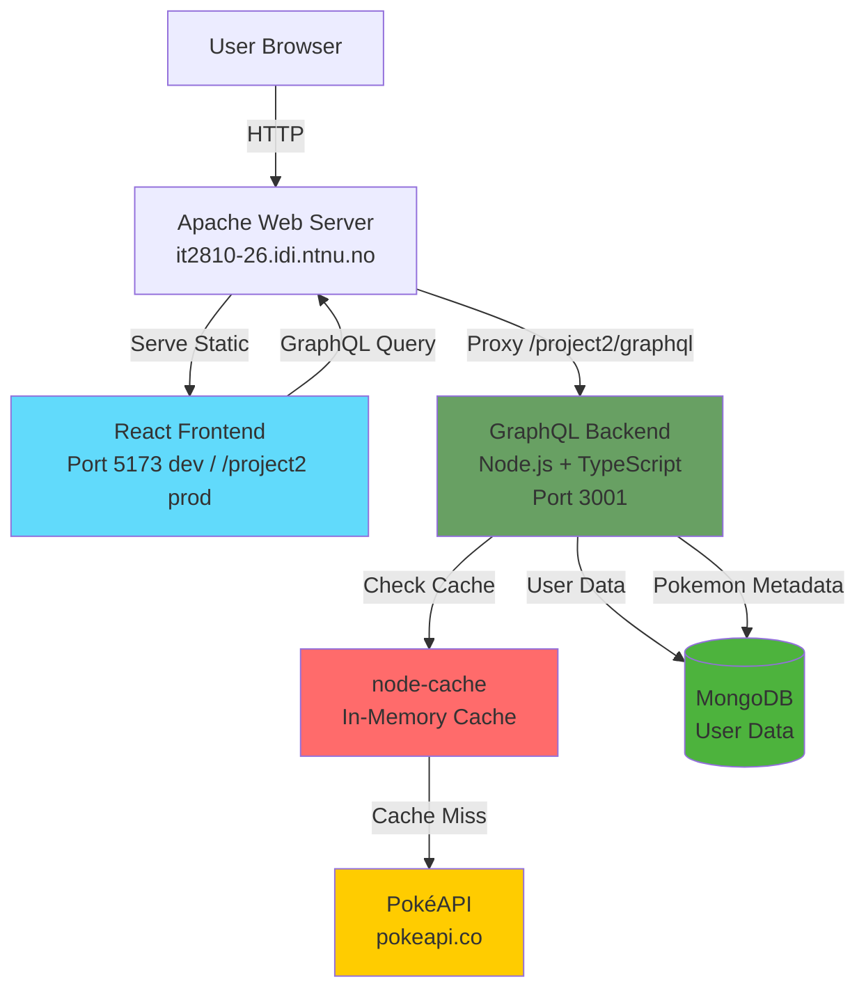

# Architecture

**[Home](../README.md)** | **[Setup](./setup.md)** | **[Architecture](./architecture.md)** | **[Testing](./testing.md)** | **[Security](./security.md)** | **[Sustainability](./sustainability.md)** | **[Development Workflow](./development-workflow.md)** | **[AI Usage](./ai-usage.md)**

---

This document describes the system architecture, data models, and key technical decisions for the PokéClicker project.

## System Overview



**Data Flow:**

1. Frontend queries GraphQL endpoint
2. Backend checks cache (Pokemon: 24h, User: 5min TTL)
3. Cache miss → fetch from PokéAPI
4. MongoDB stores user data + Pokemon metadata for search/filter
5. Results returned to frontend

## Technology Stack

### Frontend
- **Framework**: React 19 + TypeScript + Vite
- **State management**: React hooks with Apollo Client
- **Styling**: Tailwind CSS + Radix UI components
- **Build tool**: Vite

### Backend
- **Runtime**: Node.js + TypeScript
- **API**: GraphQL (Apollo Server)
- **Database**: MongoDB
- **Caching**: node-cache (in-memory)
- **Authentication**: JWT tokens

## Data Models

### User (MongoDB document)

```typescript
interface User {
  _id: ObjectId;
  username: string;
  password_hash: string;
  created_at: Date;

  rare_candy: number;
  stats: {
    hp: number;
    attack: number;
    defense: number;
    sp_attack: number;
    sp_defense: number;
    speed: number;
  };
  owned_pokemon_ids: number[]; // Array of PokéAPI IDs
}
```

### Pokemon Metadata (MongoDB document)

```typescript
interface PokemonMetadata {
  id: number;
  name: string;
  types: string[];
  generation: string;
  sprite_url: string;
}
```

Pokemon metadata is seeded from PokéAPI and stored in MongoDB to enable efficient search, filtering, and sorting. Full Pokemon details are fetched from PokéAPI on-demand.

## Database Choice: MongoDB vs PostgreSQL

We chose MongoDB because our data model doesn't require relational joins. All user data is stored in a single document per user, with nested objects (stats) and arrays (owned_pokemon_ids). This makes MongoDB a better choice:

- **No joins needed**: We never need to join data from multiple tables
- **Natural data structure**: Stats stored as nested object, not as separate rows
- **Array operations**: Adding/checking Pokémon ownership is easier with arrays
- **Flexibility**: Easier to add new fields later without migrations

## Caching Strategy

To reduce the number of API calls to PokéAPI and improve response time, we use `node-cache` with two separate caches:

### API-cache (24 hour TTL)

- Individual Pokémon cached per ID
- Type lists (all Pokémon URLs per type)
- Long TTL because PokéAPI data is static

### User-cache (5 minute TTL)

- User's owned Pokémon
- Shorter TTL because data updates more frequently
- Automatically invalidated on changes (e.g., Pokémon purchase)

### Performance Impact

Caching significantly improves response times:
- Cached requests served from memory (much faster than API calls)
- Reduces load on PokéAPI
- Cache serves as fallback if PokéAPI is down

## Image Caching Strategy

**Batch Loading:**
- 10 sprites per batch loaded in parallel
- 1 second delay between batches (60 sprites/min max)
- Prevents API rate limiting
- IndexedDB for persistent caching across sessions
- Automatic retry with exponential backoff on failures
- Initial preload: 20 Pokemon (1 page)

## Architectural Decision: Pokédex Query Optimization

### The Problem

PokéAPI's REST API doesn't support server-side filtering or sorting, requiring us to fetch all Pokémon (1025+ API calls) to display 20 filtered results. PokéAPI's GraphQL has a 100 calls/hour rate limit unsuitable for multiple users.

### Our Solution: MongoDB Metadata + PokéAPI Details

We store lightweight Pokemon metadata (id, name, types, generation) in MongoDB for filtering/sorting, then fetch full data only for the 20 displayed results from PokéAPI.

**Flow**:
```
User → MongoDB (filter/sort/paginate) → 20 Pokemon IDs
     → PokéAPI (fetch details) → 20 Pokémon displayed
```

**Benefits**:
- **Scalable**: MongoDB indexed queries are O(log n), works with millions of records
- **Efficient**: 20 API calls per page instead of 1025+
- **Fast**: Database queries + parallelized API calls with caching
- **Low memory**: Only 20 Pokémon in memory at once

## External API: PokéAPI

Pokémon information (sprites, stats, evolutions) is fetched from [PokéAPI](https://pokeapi.co/), keeping data up-to-date without duplicating their database.

## Security

See [security.md](./security.md) for detailed security measures including JWT authentication, rate limiting, and environment variable handling.
