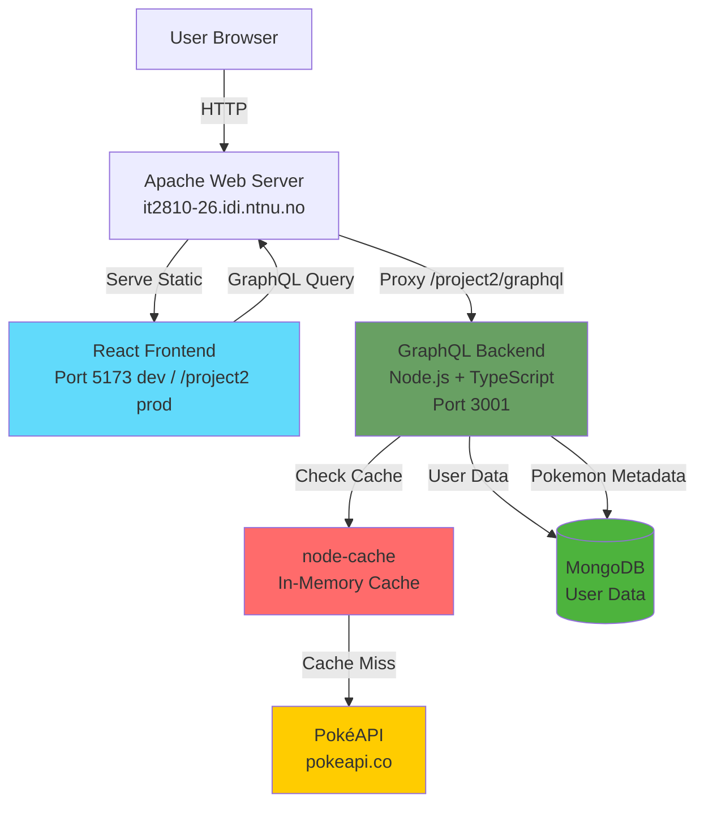

TI# Architecture

**[Home](../README.md)** | **[Setup](./setup.md)** | **[Architecture](./architecture.md)** | **[Testing](./testing.md)** | **[Security](./security.md)** | **[Sustainability](./sustainability.md)** | **[Development Workflow](./development-workflow.md)** | **[AI Usage](./ai-usage.md)**

---

This document describes the system architecture, data models, and key technical decisions for the PokéClicker project.

## System Overview



**Data Flow:**

1. Frontend queries GraphQL endpoint
2. Backend checks cache (Pokemon: 24h, User: 5min TTL)
3. Cache miss → fetch from PokéAPI
4. MongoDB stores user data + Pokemon metadata for search/filter
5. Results returned to frontend

## Technology Stack

### Frontend
- **Framework**: React 19 + TypeScript + Vite
- **State management**: React hooks with Apollo Client
- **Styling**: Tailwind CSS + Radix UI components
- **Build tool**: Vite

### Backend
- **Runtime**: Node.js + TypeScript
- **API**: GraphQL (Apollo Server)
- **Database**: MongoDB
- **Caching**: node-cache (in-memory)
- **Authentication**: JWT tokens

## Data Models

### User (MongoDB document)

```typescript
interface User {
  _id: ObjectId;
  username: string;
  password_hash: string;
  created_at: Date;

  rare_candy: number;
  stats: {
    hp: number;
    attack: number;
    defense: number;
    sp_attack: number;
    sp_defense: number;
    speed: number;
  };
  owned_pokemon_ids: number[]; // Array of PokéAPI IDs
}
```

### Pokemon Metadata (MongoDB document)

```typescript
interface PokemonMetadata {
  id: number;
  name: string;
  types: string[];
  generation: string;
  sprite_url: string;
}
```

Pokemon metadata is seeded from PokéAPI and stored in MongoDB to enable efficient search, filtering, and sorting. Full Pokemon details are fetched from PokéAPI on-demand.

## Database Choice: MongoDB vs PostgreSQL

We chose MongoDB because our data model doesn't require relational joins. All user data is stored in a single document per user, with nested objects (stats) and arrays (owned_pokemon_ids). This makes MongoDB a better choice:

- **No joins needed**: We never need to join data from multiple tables
- **Natural data structure**: Stats stored as nested object, not as separate rows
- **Array operations**: Adding/checking Pokémon ownership is easier with arrays
- **Flexibility**: Easier to add new fields later without migrations

## Caching Strategy

To reduce the number of API calls to PokéAPI and improve response time, we use `node-cache` with two separate caches:

### API-cache (24 hour TTL)

- Individual Pokémon cached per ID
- Type lists (all Pokémon URLs per type)
- Long TTL because PokéAPI data is static

### User-cache (5 minute TTL)

- User's owned Pokémon
- Shorter TTL because data updates more frequently
- Automatically invalidated on changes (e.g., Pokémon purchase)

### Performance Impact

Caching significantly improves response times:
- Cached requests served from memory (much faster than API calls)
- Reduces load on PokéAPI
- Cache serves as fallback if PokéAPI is down

## Image Caching Strategy

**Batch Loading:**
- 10 sprites per batch loaded in parallel
- 1 second delay between batches (60 sprites/min max)
- Prevents API rate limiting
- IndexedDB for persistent caching across sessions
- Automatic retry with exponential backoff on failures
- Initial preload: 20 Pokemon (1 page)

## Architectural Decision: Pokédex Query Optimization

### The Problem

When we implemented the Pokédex with search, filtering and sorting, we encountered a fundamental scalability issue:

#### 1. PokéAPI REST limitations
- No server-side filtering or sorting
- Only individual lookups (one Pokémon per API call)
- To sort 151 Kanto Pokémon alphabetically: Fetch all 151 (151 API calls) → sort in memory → show 20
- **Result**: 151+ API calls to display 20 Pokémon

#### 2. PokéAPI GraphQL
- Supports server-side filtering/sorting
- **But**: 100 calls/time rate limit (free tier)
- **Problem**: With multiple users and developers we would quickly hit the limit

#### 3. Naive solution (our first implementation)

```javascript
// Fetch ALL Pokémon → filter → sort → return 20
const allPokemon = await fetchPokemon({limit: 1025});
const filtered = allPokemon.filter(...);
const sorted = filtered.sort(...);
return sorted.slice(0, 20);
```

- **Works with 1025 Pokémon**, but...
- **Does NOT scale**: With 1 million Pokémon → Out of Memory
- **Inefficient**: Fetches 1005 Pokémon we never display
- **Slow**: Requires fetching all Pokemon before filtering

### Our Solution: MongoDB Metadata + PokéAPI Details

```
User → MongoDB (filter/sort/paginate) → 20 Pokemon IDs
     → PokéAPI (fetch full data) → 20 Pokémon to user
```

#### Implementation

**1. Seed Pokemon metadata to MongoDB** (`pnpm run seed` in backend/):
- Basic info: id, name, types, generation, sprite URL
- Run once to populate the database
- Minimal storage per Pokemon (just metadata, not full data)

**2. MongoDB handles querying:**

```javascript
const pokemonMeta = await collection
  .find({generation: 'kanto', types: 'fire'})
  .sort({name: 1})
  .skip(0)
  .limit(20)
  .toArray();
```

- Indexed for fast search
- Supports regex search, multi-field filtering
- **Works equally fast with 1 billion records** (with proper indexes)

**3. Fetch full data only for the 20:**

```javascript
const fullPokemon = await Promise.all(
  pokemonMeta.map((meta) => fetchPokemonById(meta.id))
);
```

- 20 API calls instead of 1025+
- With caching: Subsequent requests served from memory

#### Why This Scales

- **O(log n) queries**: MongoDB uses B-tree indexes
- **Constant API usage**: Always only 20 API calls per page (limit parameter)
- **Low memory usage**: Only 20 Pokémon in memory, not all 1025
- **Fast response**: Database queries are fast, API calls parallelized
- **Scales well**: Architecture doesn't change with data volume

## Security Architecture

### Issue #64: JWT Secret Security Vulnerability
- **Fixed**: Removed hardcoded fallback `'change_me'` which was a security risk
- **Implemented**: Proper environment variable validation with error handling
- **Result**: Application fails gracefully if JWT_SECRET is not set

### Issue #65: Environment Variable Configuration
- **Fixed**: Replaced hardcoded URLs with `VITE_GRAPHQL_URL` environment variable
- **Implemented**: Frontend and backend environment configuration
- **Result**: Better deployment flexibility and environment-specific config

### Issue #66: Rate Limiting Implementation
- **Fixed**: Implemented rate limiting optimized for clicker game
- **Configured**: 1000 requests per 15 minutes (much higher than typical web apps)
- **Result**: Protection against abuse while allowing normal game activity

### Security Improvements
- **Environment files**: All `.env` files are gitignored to prevent accidental commit of sensitive data
- **Rate limiting**: Game-optimized limits that allow high-frequency clicking
- **JWT security**: No hardcoded secrets, proper validation

## External API: PokéAPI

Pokémon information (name, types, stats, sprites) is fetched from [PokéAPI](https://pokeapi.co/) instead of being stored in our own database. This reduces duplication and keeps data up-to-date.

**Why use external API?**
- Always up-to-date Pokemon data
- Reduces database storage needs
- No need to maintain Pokemon data ourselves
- Rich dataset with sprites, stats, evolutions, etc.
